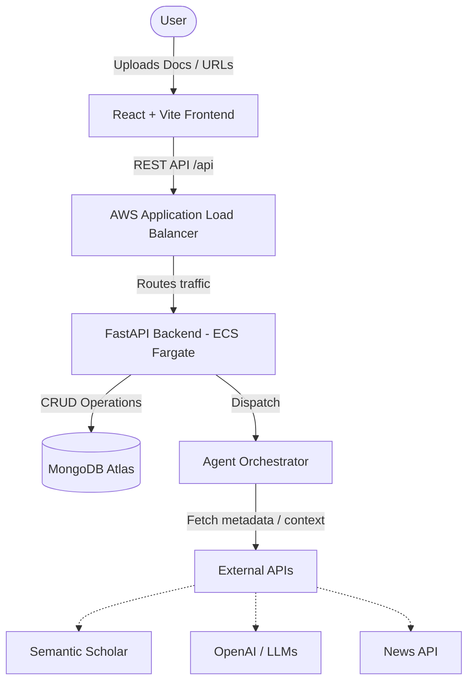
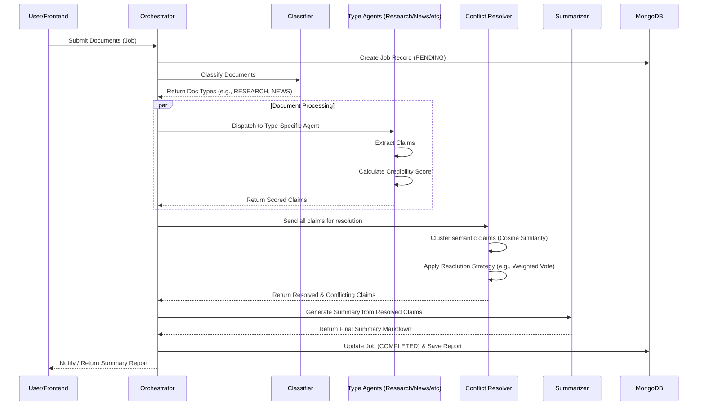

# Multi-Document Summarizer - Project Architecture

This document provides a comprehensive overview of the Multi-Document Summarizer architecture, including the system context, backend components, agent orchestration, and deployment structure.

## 1. System Context Architecture

The system enables users to submit various types of documents (research papers, news, blogs, legal) to an intelligent summarization pipeline. 



## 2. Backend Component Architecture

The backend is built with FastAPI and uses Beanie (async ODM) for MongoDB interactions. The core logic is split into agentic processing, conflict resolution, and summarization.

```mermaid
graph TD
    subgraph API Layer [API Layer - api/main.py]
        Auth[Authentication & JWT]
        JobsAPI[Jobs Endpoints]
        DocsAPI[Documents Endpoints]
        ReportsAPI[Reports Endpoints]
    end

    subgraph Service Layer
        Orchestrator[agents/orchestrator.py]
    end

    subgraph Agent Layer [Agents - agents/]
        Classifier[Classifier Agent]
        Research[Research Agent]
        News[News Agent]
        Blog[Blog Agent]
        Legal[Legal Agent]
    end

    subgraph Conflict Resolution [conflict/]
        Resolver[Conflict Resolver]
        Strategies[Resolution Strategies: Weighted, Majority, etc.]
    end

    subgraph Summarizer Layer [summarizer/]
        RAG[RAG Summarizer - FAISS + GPT]
        BART[BART Summarizer - Offline fallback]
    end

    subgraph Data [Data & DB]
        Models[db/models.py]
        TrustDB[(Trust & Domain DBs)]
    end

    API Layer --> Service Layer
    Service Layer --> Classifier
    Classifier --> Research & News & Blog & Legal
    Research & News & Blog & Legal --> Resolver
    Resolver --> Strategies
    Resolver --> Summarizer Layer
    Summarizer Layer --> RAG & BART
    Agent Layer --> Models
    Agent Layer --> TrustDB
```

## 3. Agent Orchestration Pipeline

The core intelligence of the system lies in its agentic pipeline, which processes documents based on their type and perceived credibility.



## 4. Conflict Resolution Strategies

The `conflict/strategies.py` module defines how disagreements between sources are handled:

1. **Weighted Vote (`weighted_vote`)**: Best for research papers. Weighs claims by the source's credibility score. Ties are flagged for the user.
2. **Majority Vote (`majority_vote`)**: Best for news articles. Requires agreement from at least 2 highly trusted sources.
3. **Highest Credibility Wins (`highest_credibility_wins`)**: Best for legal documents. Strict adherence to the most authoritative source (e.g., a primary government website over a blog).
4. **Conservative (`conservative`)**: Best for sensitive or unverified topics. Flags all disagreements as unresolved, prompting human review.

## 5. Deployment Architecture (AWS)

Infrastructure is managed via Terraform (`infra/`), deploying a scalable, containerized architecture to AWS.


### CI/CD Workflow
- **GitHub Actions**: Triggers on push to `main`.
- **Backend**: Runs `pytest`, builds Docker image, pushes to Amazon ECR, and updates the ECS Service.
- **Frontend**: Builds the React (Vite) bundle, syncs to the S3 bucket, and invalidates the CloudFront cache.

## 6. Directory Structure Overview

- **`agents/`**: Contains the LangChain-style orchestration and specific sub-agents.
- **`api/`**: FastAPI implementation including routing and dependency injection.
- **`conflict/`**: Algorithms for semantic clustering and resolution strategies.
- **`data/`**: Static lookup files like `news_trust_db.json`.
- **`db/`**: Beanie ODM models (Job, Document, SummaryReport, User).
- **`frontend/`**: React/Vite/TypeScript Single Page Application with TailwindCSS and dark-mode glassmorphism UI.
- **`infra/`**: Terraform modules for AWS deployment.
- **`summarizer/`**: The RAG (FAISS + OpenAI) and BART fallback implementations.
